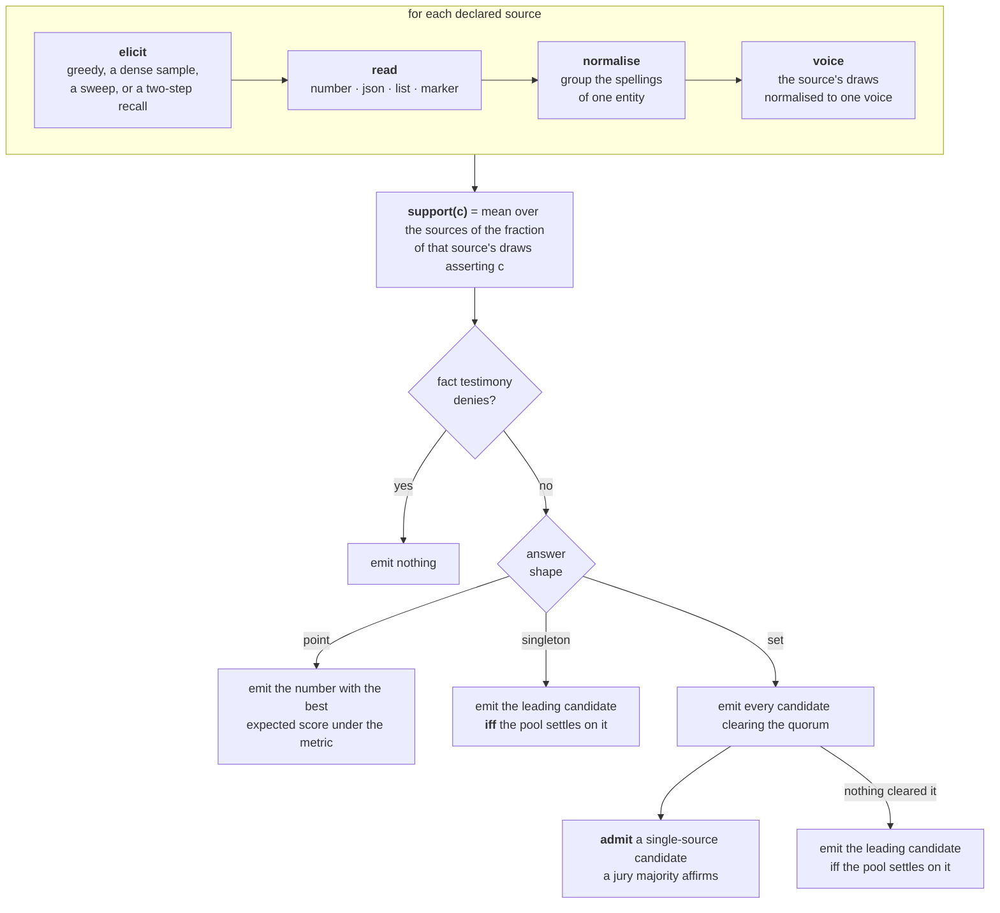

# MAVE — closed-book knowledge-base construction for LM-KBC 2026

Given a subject and a relation — `Israel` + `hasArea`, `Pfizer` +
`companyTradesAtStockExchange` — predict **every** correct object from what a
language model already knows. No retrieval, no fine-tuning, no lookups at
inference time, and everything that runs must be open-weight and sum to at most
32B parameters. Answering `[]` is a real answer: many subjects genuinely have no
object.

This system runs **one 24B open-weight model** and scores **0.6906 macro-F1** on
the shared task's hidden test labels.

| | train | validation |
|---|---:|---:|
| **macro-F1** | **0.6373** | **0.6699** |

---

## Reproduce it

Nothing to configure, no API key, no endpoint, no cost. Every model response the
system needs is committed in `cache/` (44,008 responses, 6.8 MB), so a run
replays the exact draws the published predictions were built from.

```bash
pip install -r requirements.txt

python run.py --split train    # → runs/train/predictions.jsonl + the official score
python run.py --split val      # → runs/val/predictions.jsonl   + the official score
python run.py --split test     # → runs/test/predictions.jsonl  (the submission file)
```

Each takes about eight seconds. Every run also checks its output against the
published `predictions/<split>.jsonl` and says so:

```
done — 0 errors, cache 15119 hits / 0 misses, $0.0000
identical to the published predictions/val.jsonl
```

`train` and `val` ship their labels, so those two runs print the official
evaluator's table. `test` does not ship labels — its predictions **are** the
deliverable, and `predictions/test.jsonl` is the file that was submitted.

To see what the system does before running it:

```bash
python run.py --plan
```

## Run it on your own model

The system talks to any **OpenAI-compatible** endpoint — a local vLLM, Ollama,
llama.cpp, LM Studio, or a hosted provider. It was developed against OpenRouter,
but nothing in it is specific to that.

```bash
cp .env.example .env         # set MAVE_BASE_URL and MAVE_API_KEY
python run.py --split val --live
```

`--live` draws whatever is not already cached and appends it to
`cache/<slug>.jsonl`, leaving the shipped set untouched. Without `--live` a cache
miss is an error rather than a silent API call, so a reproduction run either
replays the published draws or fails loudly.

`--model` changes the name sent over the wire without changing the cache
identity, which is what you want when the same weights are served under a
different name:

```bash
python run.py --split val --live \
  --model mistralai/Mistral-Small-3.2-24B-Instruct-2506
```

A full split is roughly **15,200 model calls**.

---

## How it works

Every relation runs the same pipeline. What differs between them is *declared* in
`config/system.yaml` — which questions to ask, how many draws each is worth, what
shape of answer the task defines — and not written in code.



### Two rules run through all of it

**Silence is not denial.** A source that recalls nothing is ignorant, not
negative. It abstains, and never counts as evidence against a candidate. Treating
the two as the same thing cost 0.03 F1 on the company relation before it was
separated out.

**One source, one voice.** A source's draws are normalised to total 1 before they
are pooled, so asking one framing nine times cannot out-shout another asked once.

### No fitted thresholds

Grep the decision layer and the only numbers that decide anything are `> ½` — the
meaning of *"the draws settle rather than scatter"* — a count of agreeing sources,
the jury's own 2-of-3, and the official scorer's 5 % numeric tolerance, which is
imported from `evaluate.py` rather than chosen. Which quorum a relation takes
follows from set-F1 arithmetic (include a candidate whose probability of being
right exceeds roughly half the achievable F1), so it is a property of the
relation, not of our splits.

### The six relations

| relation | val items | answer | how it decides | train | val |
|---|---:|---|---|---:|---:|
| `countryLandBordersCountry` | 68 | set | two named by ≥ 2 sources, plus single-source candidates a 3-lens jury affirms; a landmass source may veto | 0.9899 | 0.9785 |
| `hasArea` | 100 | point | a gazetteer and two comparisons against similar features; emit the point covered by the most candidate weight | 0.8300 | 0.8500 |
| `companyTradesAtStockExchange` | 100 | set | five elicitations incl. one in the company's own language; venue names grouped by the model; an explicit denial vetoes | 0.7260 | 0.7839 |
| `personHasCityOfDeath` | 100 | singleton | four two-step recalls; emit only if the pool settles on one city | 0.5200 | 0.6100 |
| `awardWonBy` | 10 | set | the recall sliced by decade, by discipline and by year, so it does not collapse onto the famous laureates | 0.5072 | 0.2434 |
| `hasCapacity` | 97 | point | 40 draws per item; the metric decides how *many* numbers to emit | 0.2500 | 0.2560 |
| **all** | **475** | | | **0.6373** | **0.6699** |

(train has 477 items, test 475; the per-relation counts differ by one or two
between splits.)

Two things worth reading honestly off that table. `awardWonBy` is **10 items**, so
its train-to-val swing of 0.26 is worth ±0.002 macro and says more about ten
subjects than about the method. And the metric is item-weighted, not
relation-weighted: the split-to-split differences track how many subjects in a
split have empty gold, since empty-against-empty scores a free 1.0.

### Three ideas that carried most of the score

**Ask the question the way the answer is organised.** A single "who won this
award" collapses onto the famous laureates. Sliced by decade, by discipline and by
year, the same model reaches the rest — and that is one prompt change, not a
better model.

**Let the model write the context it then reads.** The strongest sources are
two-step: recall a free-text account, then extract the answer from it. The
diversity has to live in the *account* — re-sampling the recall gives a fresh
attempt at remembering, while re-sampling the extraction only rewords a single
attempt. A comparing question ("put this beside the two features closest in area")
beats a describing one.

**Sample size changes which estimator is correct.** Four greedy draws put the
right capacity in the pool for about a third of the items; two hundred put it
there for most. Once the sample describes a distribution rather than a handful of
points, the question changes from "which value" to "which point, and how many of
them" — and under a metric with a 5 % tolerance band, the best point routinely
lies *between* the candidates rather than on one of them.

---

## Layout

```
run.py                 the entry point — the only script
config/system.yaml     the whole system: sources, answer shapes, quorums
config/prompts/        every prompt, versioned, one YAML per relation
cache/                 the shipped draw set (see cache/README.md)
data/                  train / val / test, from the organizers
predictions/           the published predictions for all three splits
evaluate.py            the official scorer, unmodified

mave/pipeline.py       the pipeline — elicit, read, normalise, vote, emit
mave/numbers.py        reading a number out of a recall, and emitting the one the metric rewards
mave/names.py          same-entity collapse for countries and people
mave/canon.py          the neural canonicaliser for stock-exchange names
mave/client.py         OpenAI-compatible chat, with usage tracking
mave/cache.py          the response cache
mave/config.py         loading config/system.yaml and the prompts
mave/runner.py         running a split, writing predictions.jsonl and meta.json
```

About 1,500 lines of Python, no framework — a good share of it comment, because
the reason a rule is shaped the way it is was usually more expensive to find than
the rule itself.

## Shared-task rules

- **Open weights, ≤ 32B summed over all inference-time components.**
  `mistralai/mistral-small-3.2-24b-instruct` — 24B, published weights, Apache-2.0.
  It is the only neural component; `run.py` refuses to start if the declared
  parameter count exceeds the budget.
- **Closed book.** No retrieval, no web access, no knowledge base is consulted at
  inference time. The only inputs are the subject string and the relation name.
- **No fine-tuning.** Stock instruction-tuned weights.
- Multi-step inference and non-neural post-processing are permitted by the rules
  and are used: the sweeps, the jury, the alias collapse and the numeric emitters.

## License and credits

`data/`, `evaluate.py` and the task definition come from the
[LM-KBC 2026 shared task](https://lm-kbc.github.io/) organizers and are covered by
the Apache-2.0 `LICENSE` in this repository. The system in `mave/` and `config/`
is ours, under the same license.
